# PointNet++
This repo is implementation for PointNet and PointNet++ in pytorch.

### 三维点云技术概述

#### 3D representation

- Point Cloud 

- Mesh
- Volumetric
- Projected View（RGB-D）

2.5D RGB-D Depth Map

3D Point Clouds

#### 点云应用

- Robot Rerception

- Augmented Reality（AR）

- VR
- Shape Design
- FaceID

#### 点云处理任务

- Oject classification 物体分类
- Parts segmentation 部件分割
- Object detection 目标检测

- Semantic segmentation (场景语义分割)

#### 数据集

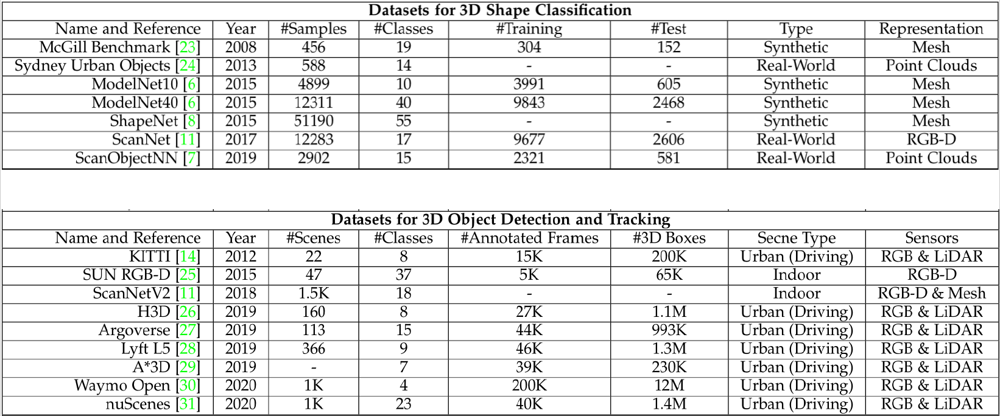

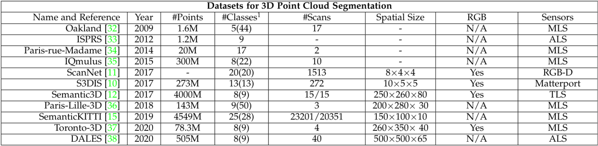

#### Challenges

- Irregular.近密远疏
- Unstructured
- Unordered
  - Invariance to permutations 置换不变性

#### Structured grid based learning

- Voxel based
- multiview based

- Point-Based Methods
  - PointNet 开山之作 MLPs --> Max pooling
  - PointNet++   Sampling --> Grouping
- Convolution-based Methods
  - 3D neighboring points
  - 3D continuous convolution
  - 3D discrete convolution
- Graph-based Methods
  - Input points --> Graph Construnction --> Feature Learning & Pooling --> Output Points

#### A taxonomy of deep learning methods for 3D point clouds

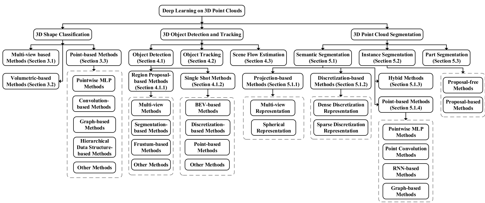

#### Chronological overview

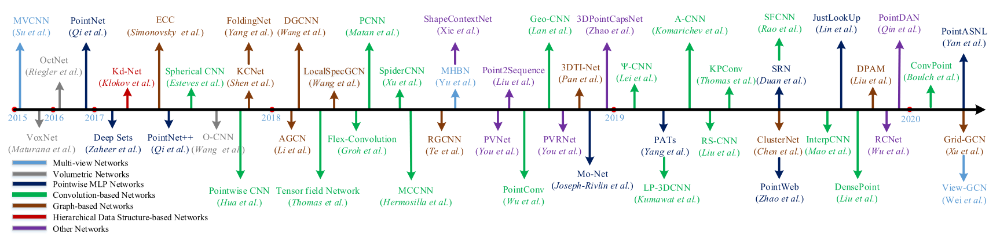

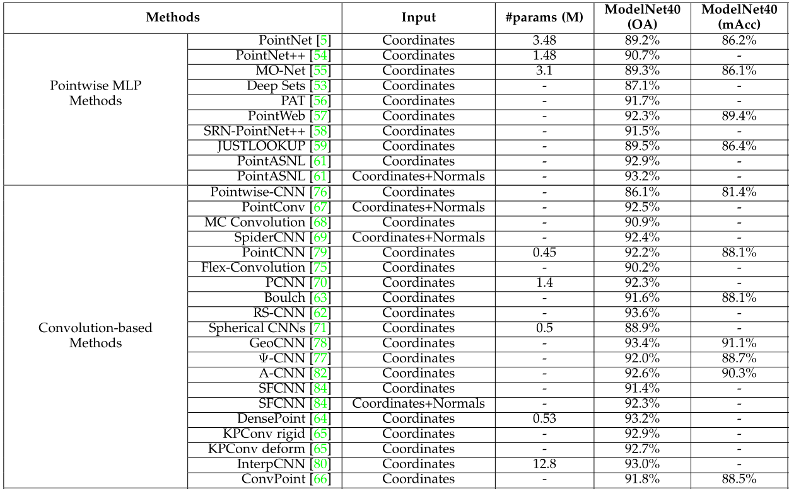

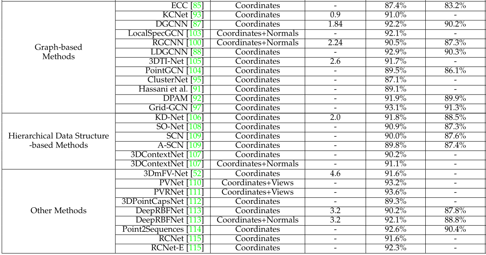

### PointNet 点云处理原理

#### Previous Works

Point clud is converted to other representations before it's fed to ad deep neural network

| Conversion           | Deep Net        | Algorithm      | Shortcoming                            |
| -------------------- | --------------- | -------------- | -------------------------------------- |
| Voxelization         | 3D CNN          | VoxNet         | 栅格量化以后分辨率会降低，存在信息丢失 |
| Projection/Rendering | 2D CNN          | Multi-view CNN | Rendering个数增加计算量也随之增加      |
| Feature etraction    | Fully Connected |                |                                        |

#### PointNet

feature learning directly

- End-to-end learning for scattered, unordered point data
- Unified framework for various tasks

##### Challenges

- Unorder point set as input

  Model needs to be invariant to N! permutations

- Invariance under geometric transformations

  Point cloud rotations should not alter classification results

PointNet(vanilla)

#### Universal Set Function Approximator 

PointNet的网络结构能够拟合任意的连续集合函数

作者证明Max pooling的引入不会降低拟合其他函数的能力（通过将特征映射到高维）

#### Input Alignment by Transformer Network

Idea: Data dependent transformation for automatic alignment

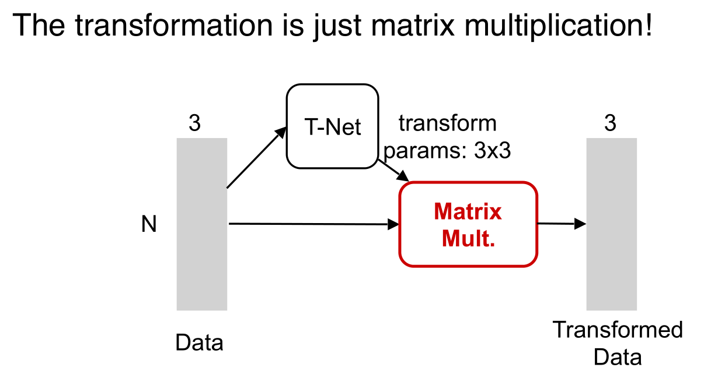

#### Embedding Space Alignment

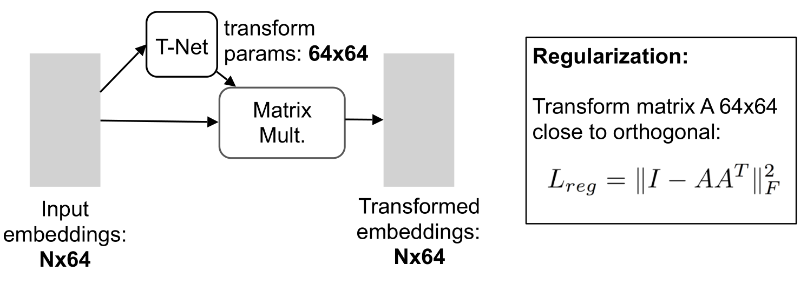

#### PointNet Classification Network

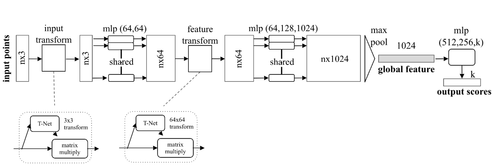

#### Extension to PointNet Segmentation Network

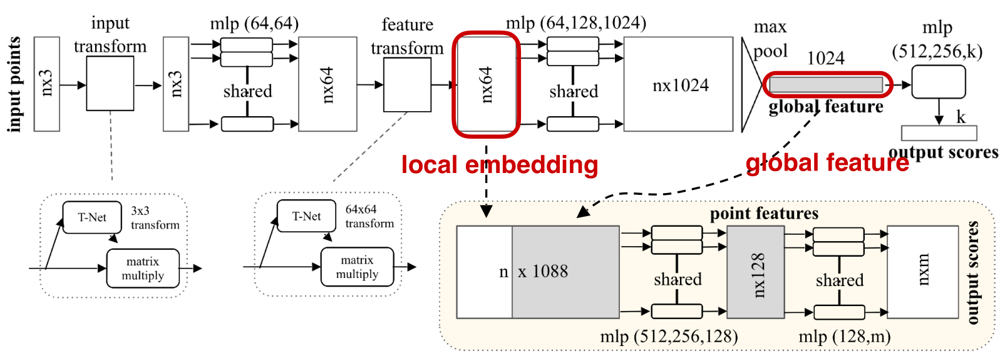

#### Model Size and Speed -- Light-weight & Fast

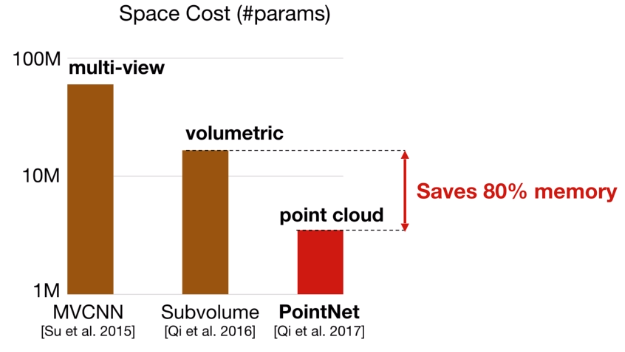

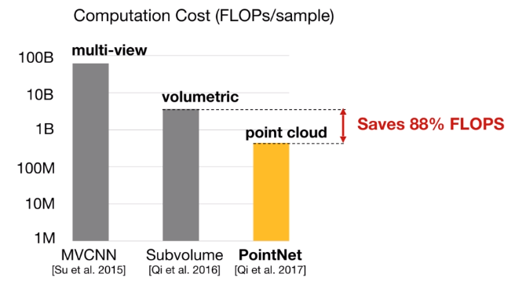

### PointNet++ 点云处理原理

PointNet没有local context

#### Basic idea

Recursively apply pointnet at local regions

- Hierarchical feature learning

- Translation invariant
- Permutation invariant

##### Hierarchical feature learning

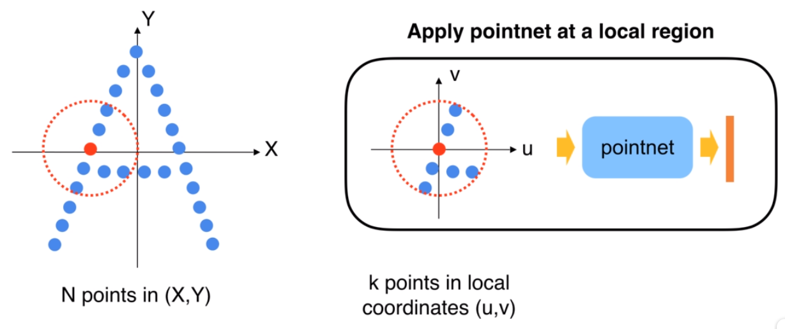

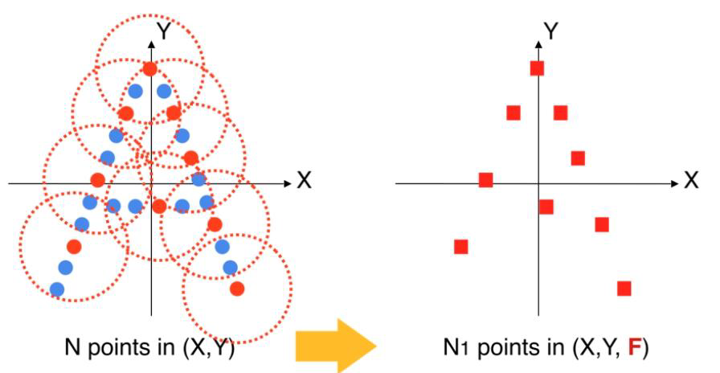

Set Abstraction：sampling + grouping + pointnet

**PointNet++ PointNet++ 总体思路 :** 首先通过将点集划分为重叠的局部区域。 与CNN 相似，提取 局部特征以捕获来自小邻域的精细几何结构。 这些局部特征将进一步分组为较大的单 元，并进行处理以生成更高级别的特征。 重复此过程，直到获得整个点集的特征为止。

- Sampling
  - Uniform sampling
  - Farthest sampling
- Grouping
  - K nearest neighbors
  - Ball query（within range)

- Apply PointNet to each group

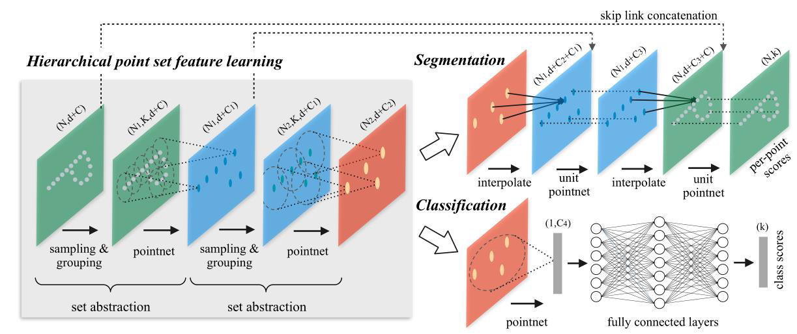

#### 对于非均匀点云的处理方法

- Multi-scale grouping（MSG）
- Multi-resolution grouping(MRG)

#### Network Architectures

- SSG:single scale grouping
- FP（feature propagation）

#### Results: Non-Euclidean Space

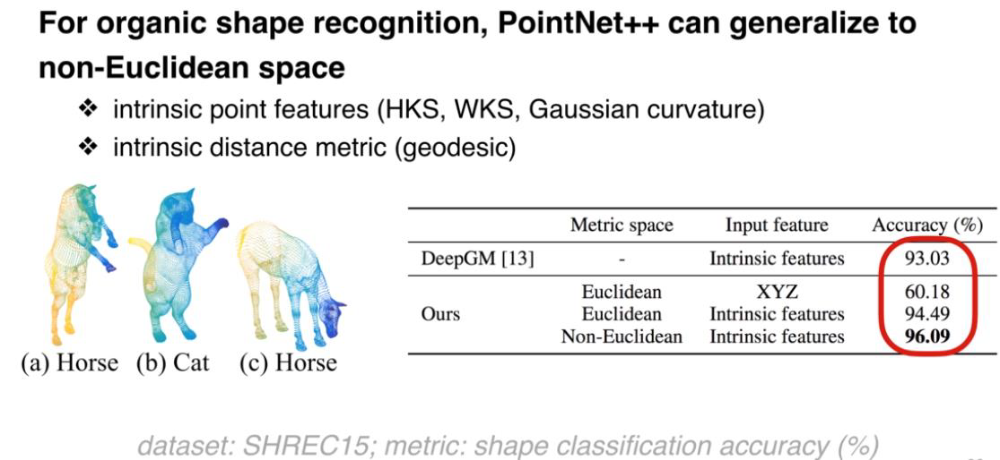

### 卷积感受野

在卷积神经网络中，感受野（Receptive Field）的定义是卷积神经网络每一层输出的特征图（feature map）上的像素点在输入图片上映射的区域大小。再通俗点的解释是，特征图上的一个点对应输入图上的区域，如图1所示。

/20190718164953811.png)